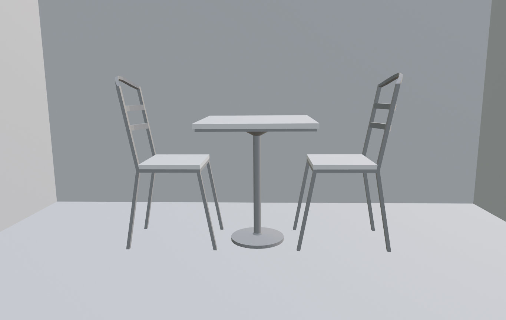
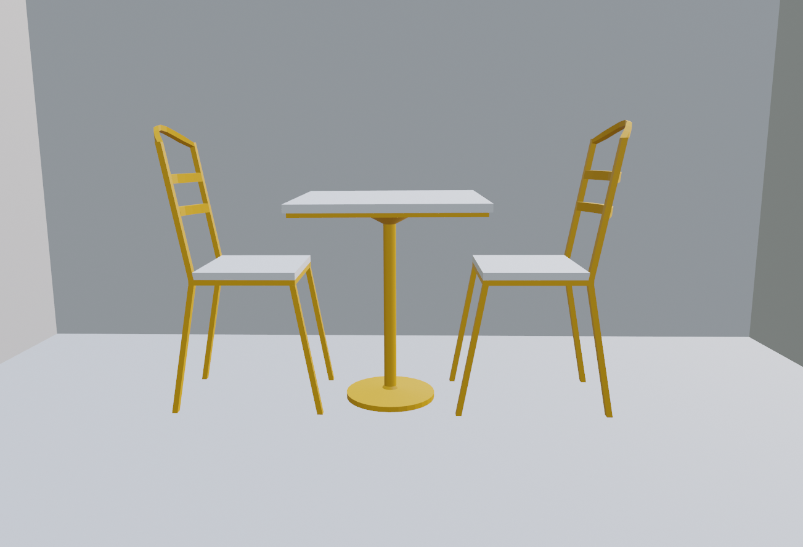
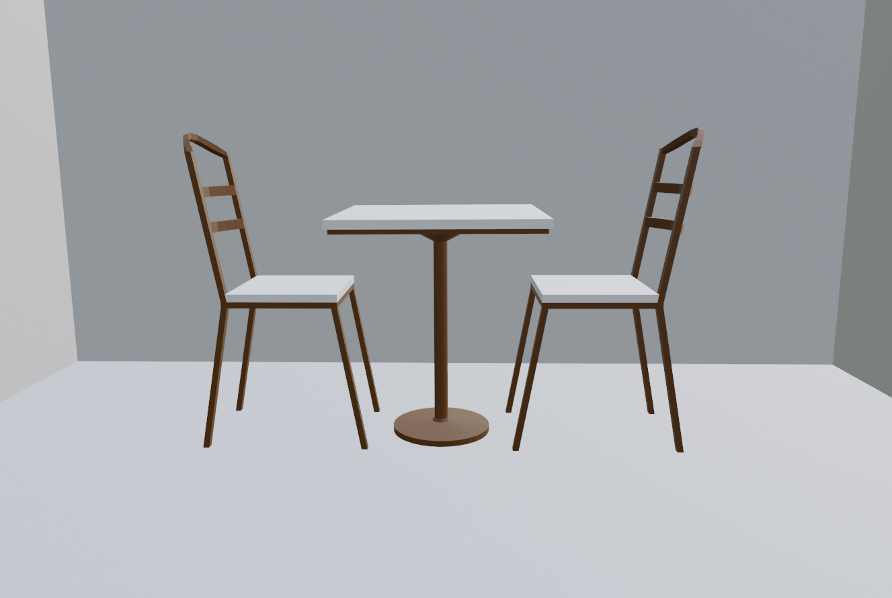
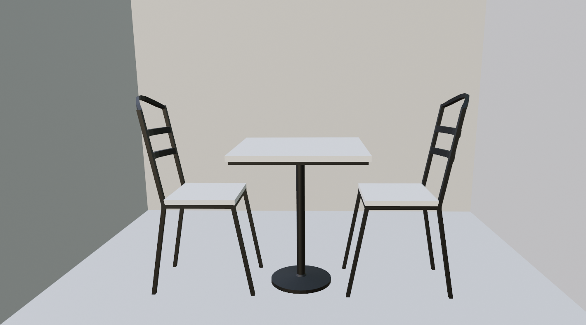
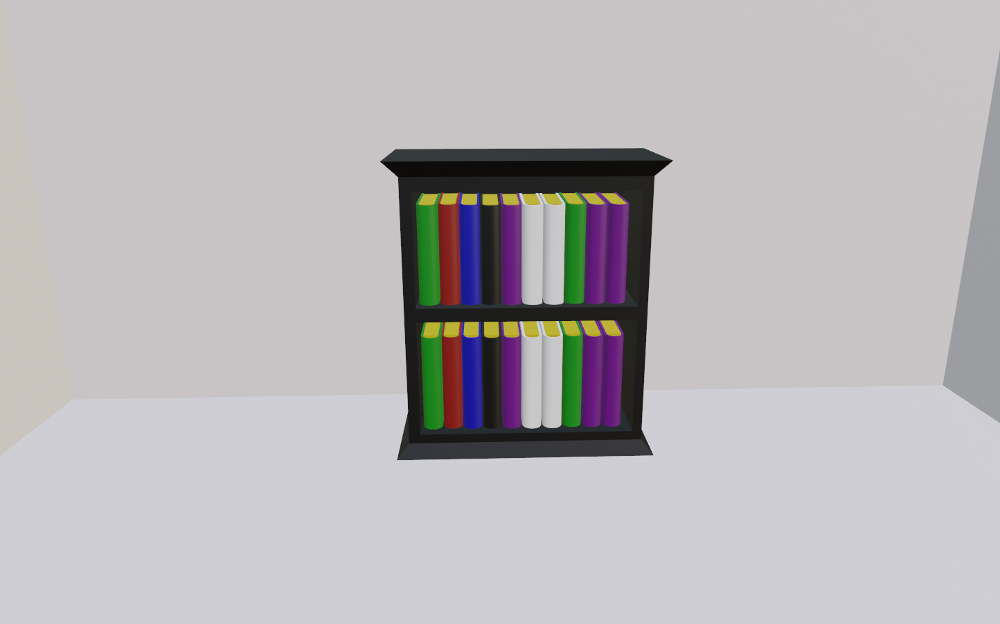
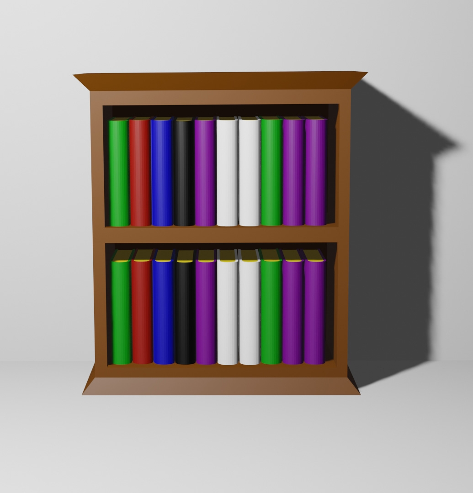
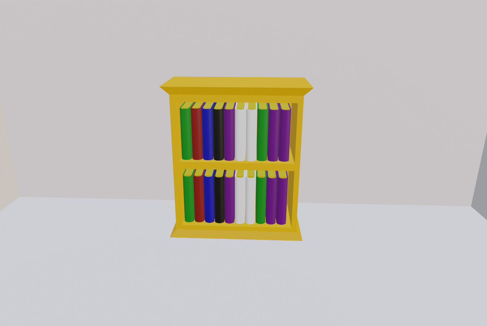
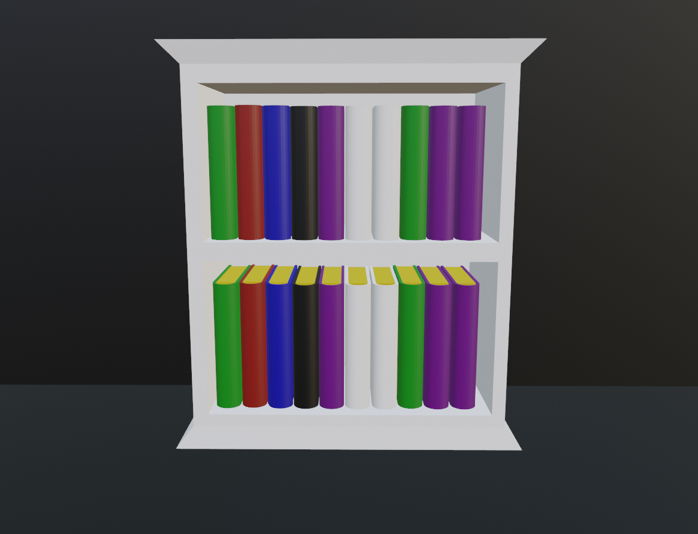
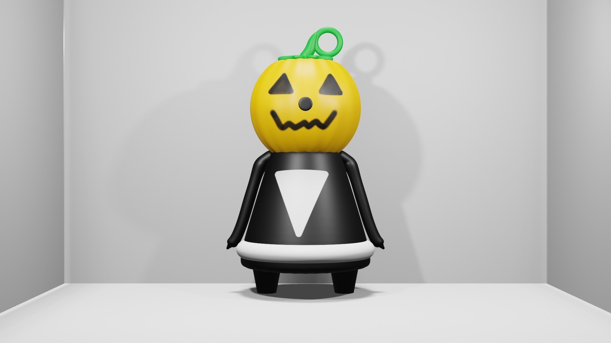
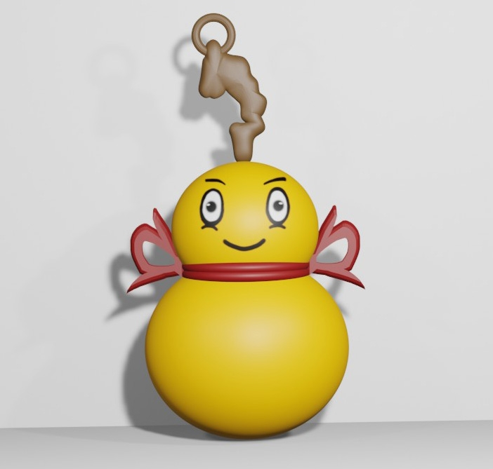

# BlenderDumpster
Blender objects/characters that i created. You can use it anywhere including commercial work, except selling / distributing as a asset. (Example: Like Uploading in unity store.)
Blender + fbx file created by me.
You can't upload as a asset to any store. (Unity Store, Unreal Engine Store, CSP store etc. You get the idea.) Because i am doing that. Other than that you can pretty much do anything with it. You can use it in commercial or private work, print in 3d and sell as accessory online without notifying me.

Backface Culling Fix
-----------------------------------------------------------------------------------------------

Personal note: Use Viewport Shading --> Options --> Backface Culling in every blender file at start. So you can avoid spending your time by pulling out your hair wondering what went wrong.

Recalculate Outside Normals: Tab (Edit Mode) -> Hold "A" Move mouse up to select all -> Shift+N

Recalculate Inside Normals: Tab (Edit Mode) -> Hold "A" Move mouse up to select all -> Ctrl+Shift+N

If nothing worked

Flip: Tab (Edit Mode) -> Hold "A" Move mouse up to select all -> Mesh -> Normals -> Flip

(While fliping faces you can also select only problematic area that looks wrong.)

Blender 3D Mesh Recalculate All Object Outside and Inside Normals
-----------------------------------------------------------------------------------------------
September 16

Howto: 

Hold "A" Move mouse up to select all -> Paste Code to Scripting Tab -> Run The Code

Code:

import bpy

if bpy.context.selected_objects != []:

for obj in bpy.context.selected_objects: #loop through all the selected objects

if obj.type == 'MESH':

bpy.context.view_layer.objects.active = obj

bpy.ops.object.editmode_toggle() #enter edit mode

bpy.ops.mesh.select_all(action='SELECT') #select all objects elements

bpy.ops.mesh.normals_make_consistent(inside=True) #recalc normals inside

bpy.ops.mesh.normals_make_consistent(inside=False) #recalc normals outside

bpy.ops.object.editmode_toggle() #exit edit mode

3D Furniture Cafe Table Multicolor
-----------------------------------------------------------------------------------------------
</img>
</img>
</img>
</img>

patreon@nyarlko 3D Furniture Cafe Table Multicolor.zip

3D Furniture Bookshelf Mini Multicolor
-----------------------------------------------------------------------------------------------
</img>
</img>
</img>
</img>

patreon@nyarlko Furniture Bookshelf Multicolor Lucky13.zip

3D Ornament Pumpkin Blender
-----------------------------------------------------------------------------------------------

</img>
Ornament_Pumpkin_Lucky13_Patreon_Nyarlko.zip

3D Ornament Yellow Blender
-----------------------------------------------------------------------------------------------
Ornament_Yellow_Patreon_nyarlko.zip
</img>

SAR9 SP Çizim
-----------------------------------------------------------------------------------------------
</img>

Illustration
-----------------------------------------------------------------------------------------------
Patreon4.7z.001
Patreon4.7z.003
Patreon4.7z.002
